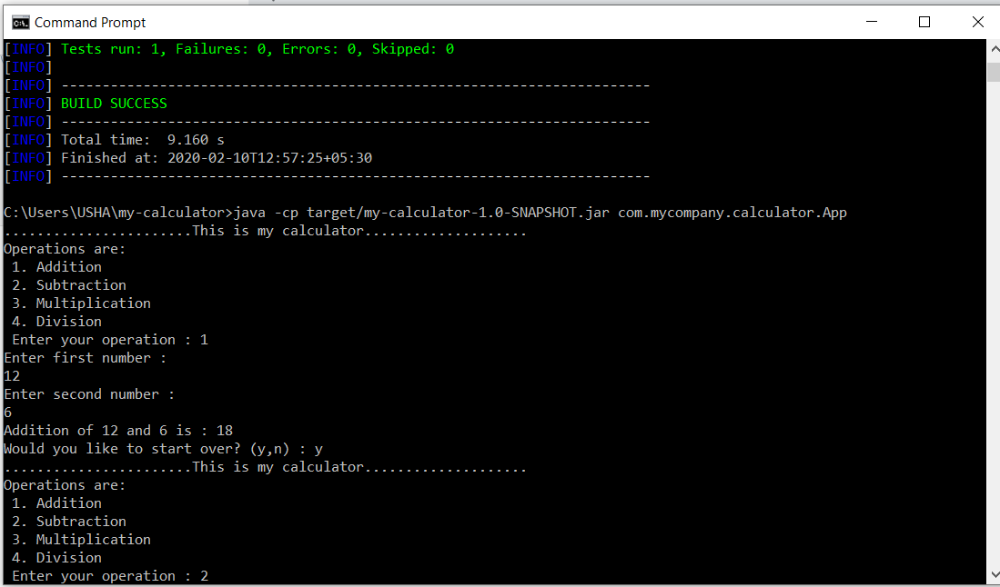
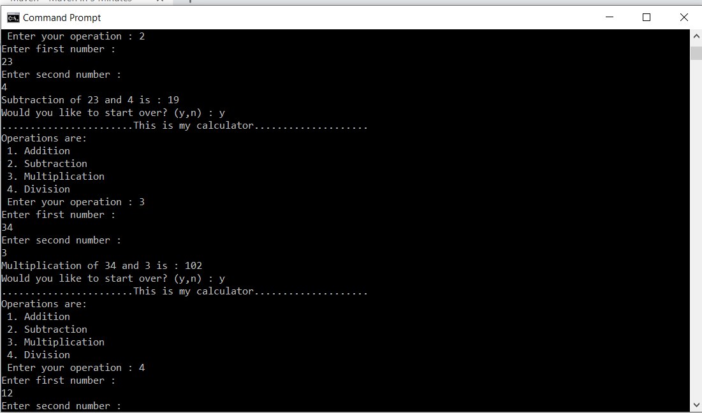
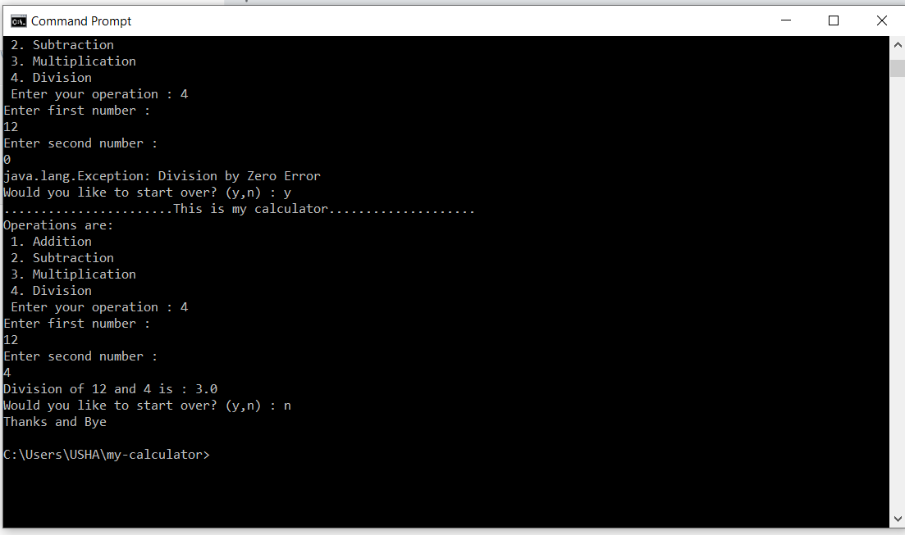

# UshasriMavuri_DesignPrinciples


# Week-3
## Design Principles

 * Implement Calculator Application with Add, Divide, Multiply and Subtract Methods
 * Implement Layered Architecture
 * Implement SOLID, KISS, DRY, YAGNI principles
 
### Creating a Maven Project

```sh
mvn archetype:generate -DgroupId=com.mycompany.calculator -DartifactId=my-calculator -DarchetypeArtifactId=maven-archetype-quickstart -DarchetypeVersion=1.4 -DinteractiveMode=false
```

### How I Did
 * To implement ***Calculator*** application I've used **2-tier architecture**.
 * I've created 2 packages with the names as `com.mycompany.calculator` and `com.mycompany.calculatoroperations` in which I've created 2 classes named as `App.java` and `CalculatorOperations.java` respectively.
 * Importing calculatoroperations package, I've called appropriate method to do any operation.

### Build the Project

```sh
mvn package
mvn test
```
You may test the newly compiled and packaged JAR with the following command:

```sh
java -cp target/my-calculator-1.0-SNAPSHOT.jar com.mycompany.calculator.App
```

- I've obtained the result as:






